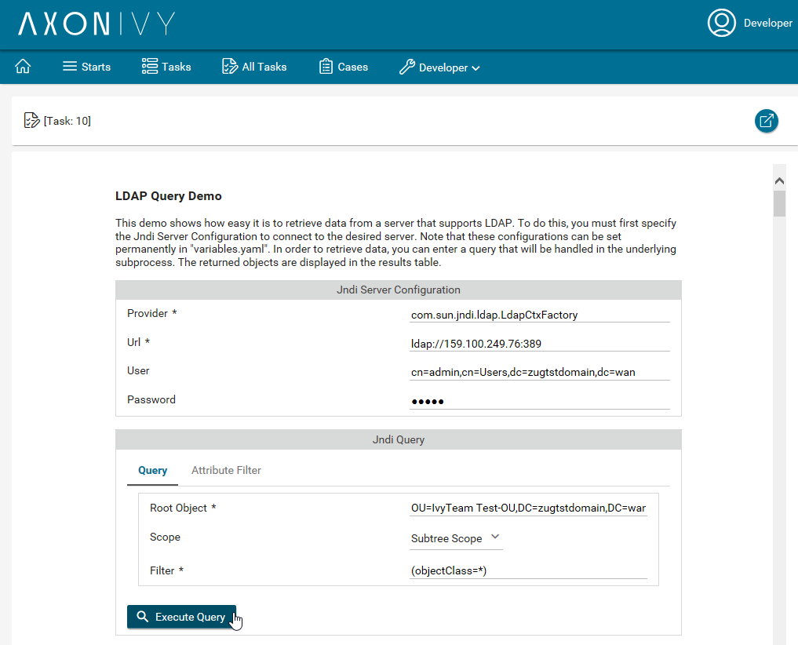
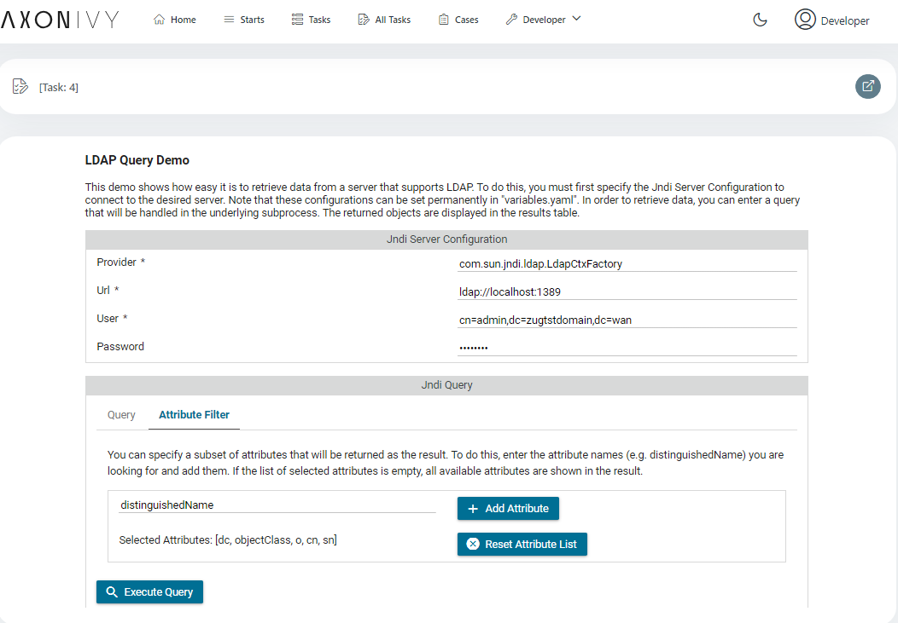
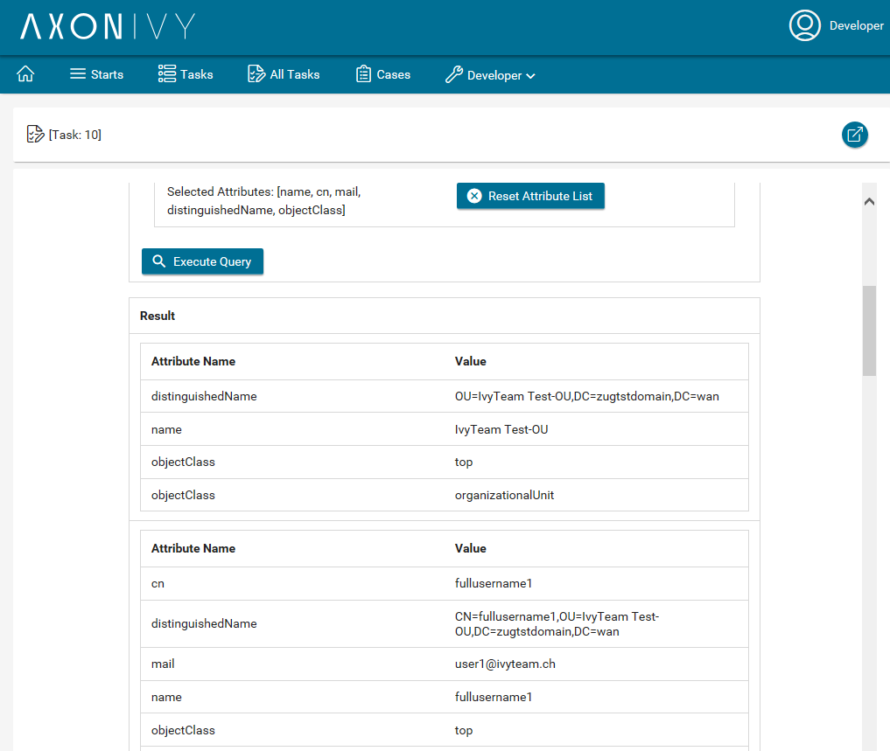
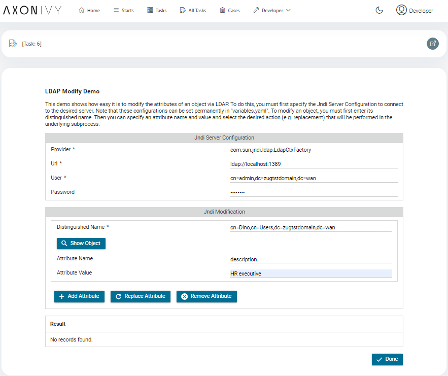
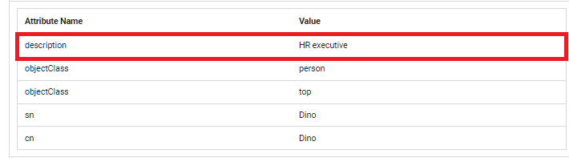

# Active Directory Connector

**Active Directory (AD)** is a directory service developed by Microsoft for Windows domain networks, which provides centralized management and authentication of users, computers, and other resources within the network. It uses the **Lightweight Directory Access Protocol (LDAP)** as its underlying protocol to query and manage directory information. LDAP is the standard protocol that AD employs to authenticate and authorize users and resources within a network.

Axon Ivy's **Active Directory** connector helps you accelerate process automation initiatives by querying and writing Active Directory objects in your business process. This connector:

- Allows you to easily query your Active Directory entries
- Gives you the possibility to modify attributes of Active Directory objects
- Enables the creation and addition of new Active Directory entries
- Lets you delete Active Directory objects
- Supports you with a demo implementation to reduce your integration effort.

## Demo
### Query Demo




### Modify Demo



## Security and Safe Usage

This is a library component — it executes whatever LDAP filter your code builds. The connector does not expose raw user input directly to LDAP operations.

**Risk:** LDAP injection can occur if your application concatenates untrusted input (form fields, URL parameters, etc.) into a filter string without escaping.

**Impact:** Attackers could enumerate the directory, bypass authentication logic, or disclose sensitive attributes.

### How to Stay Safe
1. **Always escape user input** before putting it in a filter using `LdapFilterUtil.escapeLdapFilterValue()`.
2. **Use allowlists** for known identifiers (e.g., validate username format).
3. **Use minimal permissions** for the LDAP service account.

### Example: Safe Filter Construction

Use the built-in `LdapFilterUtil` class to escape any untrusted values:

```java
import com.axonivy.connector.ldap.util.LdapFilterUtil;

// Escape user input
String safeUid = LdapFilterUtil.escapeLdapFilterValue(userInput);
String filter   = "(&(objectClass=person)(uid=" + safeUid + "))";

// Build and execute the query
LdapQuery query = LdapQuery.create()
    .rootObject("dc=example,dc=com")
    .filter(filter)
    .toLdapQuery();
```

The utility escapes special LDAP characters (`\`, `*`, `(`, `)`, NUL) per RFC 4515.


## Setup

### Setting Up an Active Directory Instance
- If an existing Active Directory instance is unavailable, you can quickly set up a new instance using a Docker container. A sample Docker Compose file is provided at the following path: `ldap-connector-demo/docker/docker-compose.yaml`. This setup is intended for demonstration and testing purposes. To start the container, provide the admin password config in `ldap-connector-demo/docker/docker-compose.yaml` and execute the command:

```
docker-compose up -d
```

- If docker is not available in your local machine, an online LDAP test server can be utilize as a read-only instance
[Forumsys Online LDAP Test Server](https://www.forumsys.com/2022/05/10/online-ldap-test-server/)

**Update Active Directory connection variable**
In order to use this product you must configure multiple variables.
Add the following block to your `config/variables.yaml file` of our main Business Project that will make use of this product:

```
@variables.yaml@
```