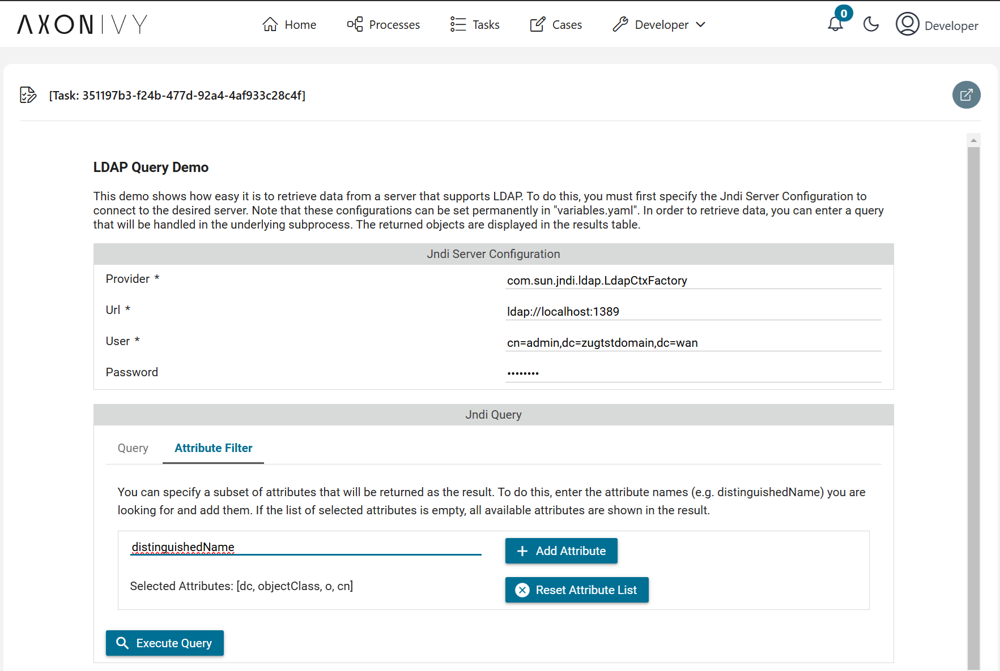
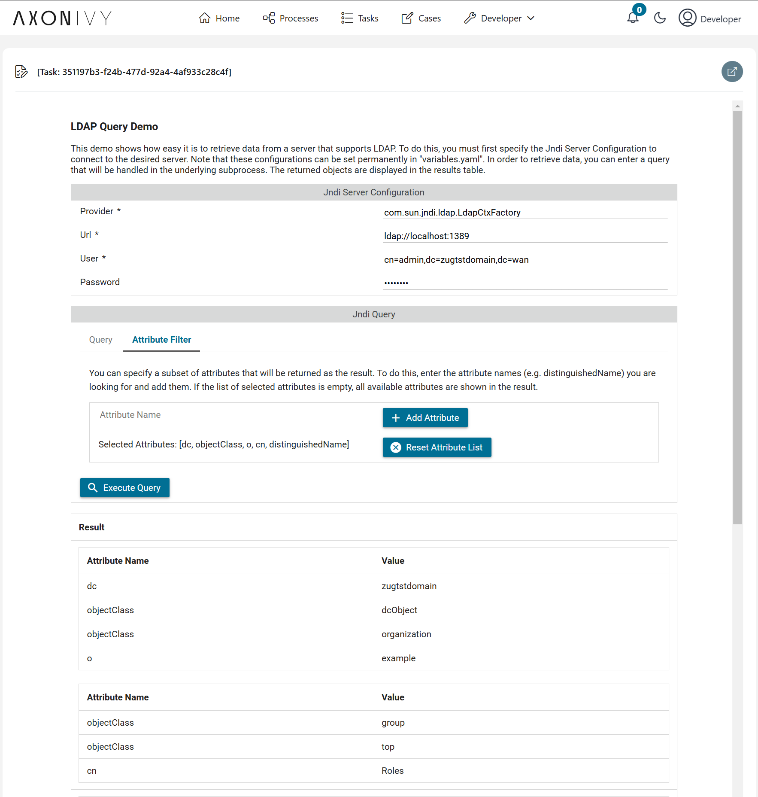
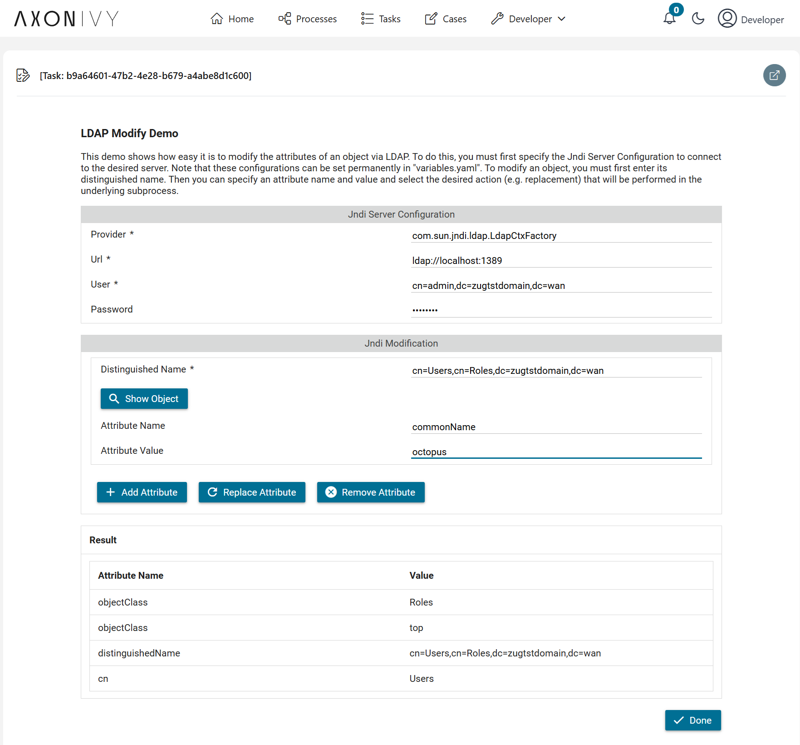

# Active Directory Connector

**Active Directory (AD)** is a directory service developed by Microsoft for Windows domain networks, which provides centralized management and authentication of users, computers, and other resources within the network. It uses the **Lightweight Directory Access Protocol (LDAP)** as its underlying protocol to query and manage directory information. LDAP is the standard protocol that AD employs to authenticate and authorize users and resources within a network.

Axon Ivy's **Active Directory** connector helps you accelerate process automation initiatives by querying and writing Active Directory objects in your business process. This connector:

- Allows you to easily query your Active Directory entries
- Gives you the possibility to modify attributes of Active Directory objects
- Enables the creation and addition of new Active Directory entries
- Lets you delete Active Directory objects
- Supports you with a demo implementation to reduce your integration effort.

## Demo
### Query Demo

### Modify Demo

