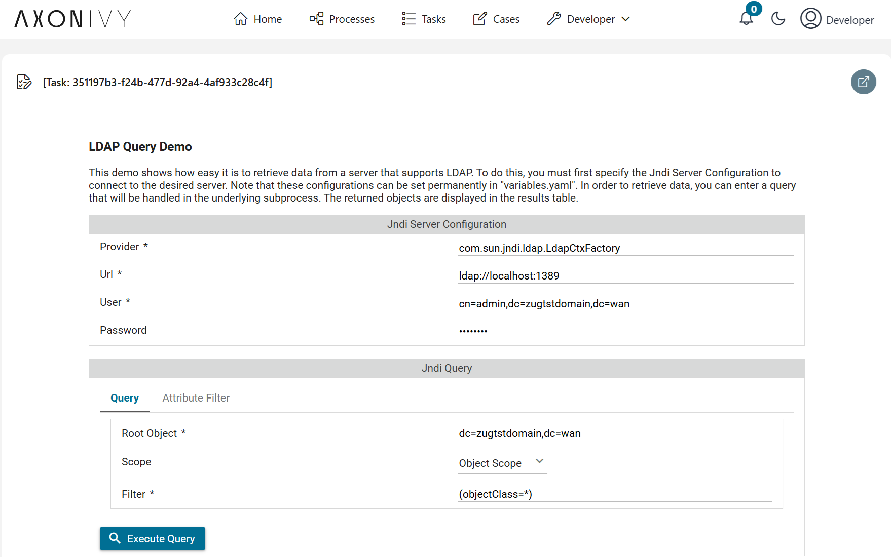
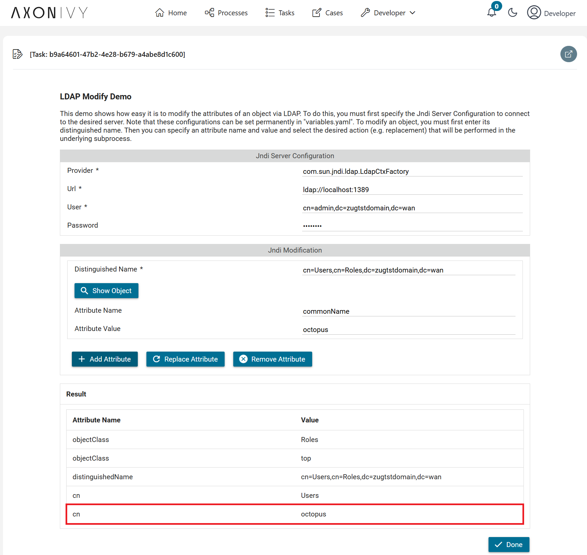

# Active Directory Konnektor
**Active Directory (AD)** ist ein von Microsoft entwickelter Verzeichnisdienst für Windows-Domänennetzwerke, der die zentrale Verwaltung und Authentifizierung von Benutzern, Computern und anderen Ressourcen im Netzwerk ermöglicht. Es verwendet das **Lightweight Directory Access Protocol (LDAP)** als zugrunde liegendes Protokoll, um Verzeichnisinformationen zu lesen und zu verwalten. LDAP ist das Standardprotokoll, das AD zur Authentifizierung und Autorisierung von Benutzern und Ressourcen im Netzwerk verwendet.

Der **Active Directory**-Konnektor von Axon Ivy liest, erstellt und bearbeitet Active Directory-Objekte wie Benutzerkonten, Drucker oder Freigaben für deine Geschäftsprozessen. 

Dieser Konnektor:
- ermöglicht es dir, Active Directory-Einträge zu lesen
- gibt dir die Möglichkeit, Attribute von Active Directory-Objekten zu ändern
- ermöglicht die Erstellung neuer Active Directory-Einträge
- lässt dich Active Directory-Objekte löschen
- unterstützt dich mit einer Demo-Implementierung, die einfach in eine Axon Ivy Applikation zu integrieren ist.

## Demo
### Query Demo



### Modify Demo



## Setup

### Setting Up an Active Directory Instance
- If an existing Active Directory instance is unavailable, you can quickly set up a new instance using a Docker container. A sample Docker Compose file is provided at the following path: `ldap-connector-demo/docker/docker-compose.yaml`. This setup is intended for demonstration and testing purposes. To start the container, provide the admin password config in `ldap-connector-demo/docker/docker-compose.yaml` and execute the command:

```
docker-compose up -d
```

- If docker is not available in your local machine, an online LDAP test server can be utilize as a read-only instance
[Forumsys Online LDAP Test Server](https://www.forumsys.com/2022/05/10/online-ldap-test-server/)

**Update Active Directory connection variable**
In order to use this product you must configure multiple variables.
Add the following block to your `config/variables.yaml file` of our main Business Project that will make use of this product:

```
@variables.yaml@
```